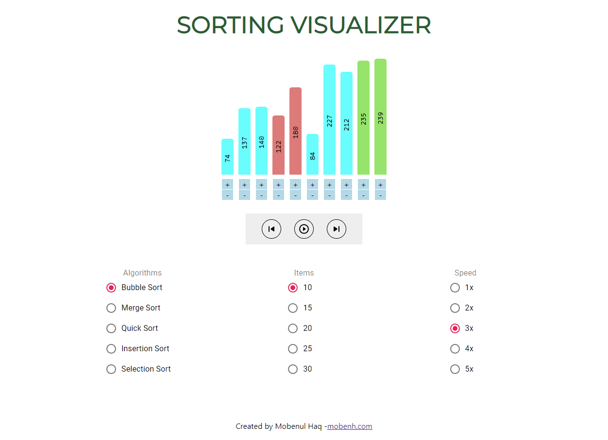

# Sorting Visualizer
In this project you can visualize how diffrent sorting algrithm sort an array of numbers. I use Bubble Sort, Merge Sort, Quick Sort, Insertion Sort, and Selection Sort.


https://sortingvisualizer.mobenh.com

## Technologies Used
* HTML
* CSS
* React
* Node

## Dependencies

* Install Node - https://nodejs.org/en/download
* Install npm
```
npm install -g npm
```

## Executing program

* Download the repository to your computer and go to project file
```
git clone https://github.com/mobenh/sortingvisualizer
cd sortingvisualizer
```
* Add node modules to project files by runing comand
```
npm install
```
* Finally view the project locally
```
npm start
```

## Deploying to AWS
Follow this tutorial video - https://www.youtube.com/watch?v=mls8tiiI3uc&t=1147s&ab_channel=BeABetterDev

### AWS Technologies used
* S3 Buckets (for static web page hosting)
* Route 53 (for domain registration and DNS record creation)
* Certificate Manager (for acquiring certificates)
* CloudFront (for attaching secure certificates and caching)

